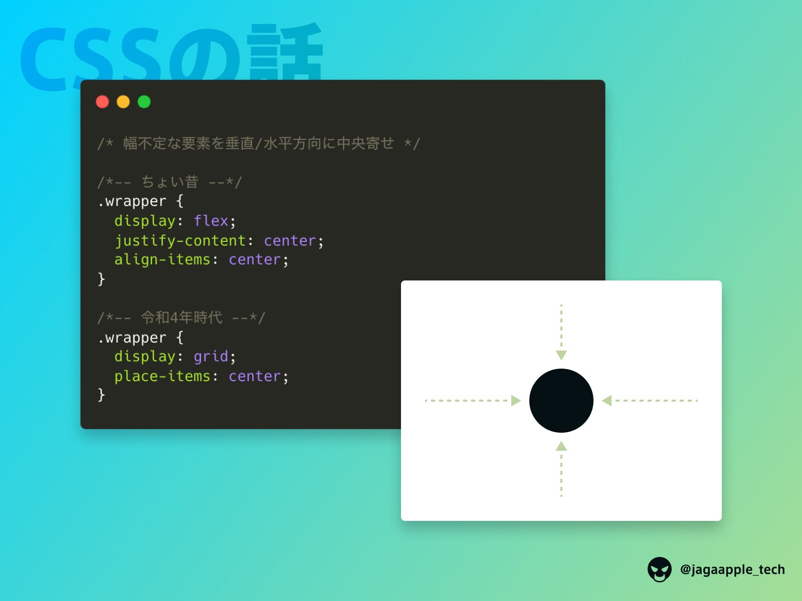

# 上下中央に配置する方法まとめ



```css
.item {
    display: grid;
    place-items: center;
}
```

もしくはこちらでもいけるらしい。

```css
.item {
    display: grid;
    place-items: center;
}
```

[2022年のモダンCSS改](https://speakerdeck.com/tonkotsuboy_com/2022nian-falsemodancssgai?slide=10)

```css
.item {
    position: fixed; // absoluteも可
    inset: 0;
    margin: auto;
}
```

```css
.item {
    display: flex;
    justify-content: center;
    align-items: center;
}
```