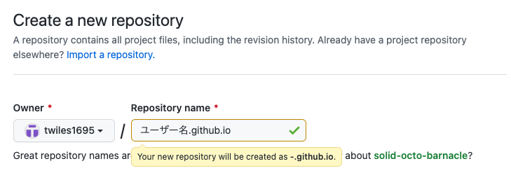

# Mkdocsを使ったGitHub Pagesの作成方法

## 1. Mkdocsとは

Markdownで書いたドキュメントを自動的にHTMLに変換し、静的なHTMLサイトを構築してくれる静的サイトジェネレータです。Pythonが必要になります。

これをGithub Pagesと組み合わせることで、レンタルサーバーなどを用意しなくてもレンタルするブログよりも簡単にドキュメント化＆サーバーへアップが可能になります。ただターミナルをガンガン使うので上級者向けです。

## 2. 作成手順

### 2.1 Mkdocsのインストール

```
$ pip install mkdocs
```
自分の場合は`python 3.7`なのでpip3でした。

### 2.2 Githubリポジトリの作成、クローン

公開するURLは

https://{ユーザー名}.github.io/{リポジトリ名}

とすることもできますが、

https://{ユーザー名}.github.io

というスッキリしたURLにすることができます。

今回は後者の方で進めます。リポジトリ名を以下のようにします。


ここのリポジトリ名が間違っているとスッキリしたURLにならないので注意。

リポジトリ作成後、ローカルの作成したいディレクトリでクローンし、移動します。

```
$ git clone https://github.com/{ユーザー名}/{ユーザー名}.github.io.git
$ cd {ユーザー名}.github.io
```

以下でプロジェクトを作成し、
```
$ mkdocs new {プロジェクト名}
$ cd {プロジェクト名}
```
ディレクトリを切り替えてローカルサーバーで実行。
```
$ mkdocs serve
```

ちなみにMkdocsには終了コマンドが無いため実行しているターミナルで`Ctrl + C`をして終了。

### 2.3 GithubへPush

正常に表示できたら、次はGithubへプッシュします。

```
$ git add .
$ git commit -m "Mkdocsインストール"
$ git push origin main
```
GitHubへPushまたはCloneする際のパスワードは、自身で登録したパスワードから***個人アクセストークン***を使用するよう変更されたため、アクセストークンをGitHub設定から発行する必要があります。

詳細はこちらを参照。

[GitHubへPush|GitHub Pagesを使って静的サイトを公開する方法](https://qiita.com/motoJinC25/items/01b391e3890483cfa78d#github%E3%81%B8push)

### 2.4 デプロイ

ローカルサーバーを実行したディレクトリで

```
$ mkdocs gh-deploy
```
をすると、`gh-pages`というブランチが作成されます。

このブランチでは公開用のファイルが自動生成され、mainブランチとは内容が異なります。

このブランチをリポジトリのSetting > Code and automation > Pagesから公開ブランチとして指定します。

これがググってもあまり載っておらず、なかなか公開サーバーに反映されず躓きました。


保存が完了すると、https://{ユーザー名}.github.io で公開されます。

## 3. 参考
[mkdocsを使ったGitHub Pagesの作成方法|note](https://aiedoc.github.io/note/Tips/Mkdocs/mkdocs%E3%82%92%E4%BD%BF%E3%81%A3%E3%81%9FGitHubPages/)

[MkDocs基本|黒鳥のメモ](https://kurotori4423.github.io/KurotoriMkDoc/MkDocs%E8%A7%A3%E8%AA%AC/MkDocs%E3%82%BB%E3%83%83%E3%83%88%E3%82%A2%E3%83%83%E3%83%97/)
