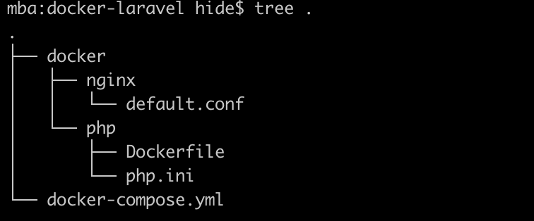
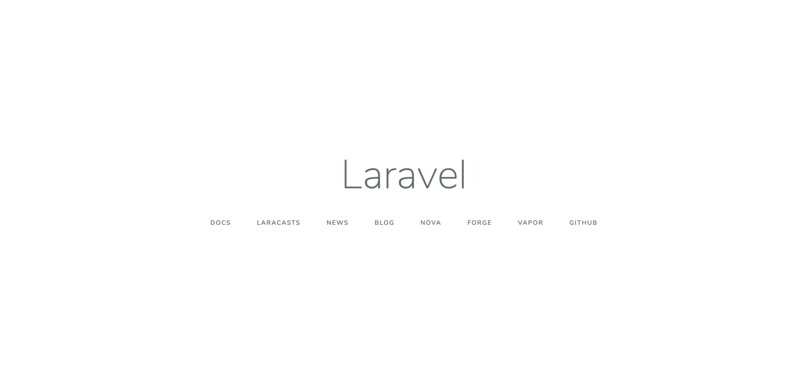

# Docker + Laravel 環境構築

## 環境

- Laravel 6系
- PHP 7.3.33
- Nginx
- MySQL 5.7

## 扱うファイル


`docker-compose.yml` 

`Dockerfile` PHPのバージョンを指定

## 使用するコマンド

```zsh
$ docker-compose up -d
$ docker-compose ps
$ docker-compose exec app bash
$ composer create-project --prefer-dist laravel/laravel laravel-project "6.*"
$ docker-compose build
$ composer update
(laravel-projectの階層で)
$ npm install
```

## 手順

### php.iniの設定

```ini
[Date]
date.timezone = "Asia/Tokyo"
[mbstring]
mbstring.internal_encoding = "UTF-8"
mbstring.language = "Japanese"
[opcache]
opcache.memory_consumption=128
opcache.interned_strings_buffer=8
opcache.max_accelerated_files=4000
opcache.revalidate_freq=60
opcache.fast_shutdown=1
opcache.enable_cli=1
```

### default.confの設定

```conf
server {
  listen 80;
  root /var/www/laravel-project/public;
  index index.php;
  location / {
    root /var/www/laravel-project/public;
    index index.php;
    try_files $uri $uri/ /index.php$query_string;
  }
  location ~ \.php$ {
    try_files $uri =404;
    fastcgi_split_path_info ^(.+\.php)(/.+)$;
    fastcgi_pass app:9000; 
    fastcgi_index index.php;
    include fastcgi_params;
    fastcgi_param SCRIPT_FILENAME $document_root$fastcgi_script_name;
    fastcgi_param PATH_INFO $fastcgi_path_info;
  }
}
```

### Dockerfileの設定

```dockerfile
FROM php:7.3-fpm 
COPY php.ini /usr/local/etc/php/
RUN apt-get update && apt-get install -y \
    zlib1g-dev \
    libzip-dev \
    vim \
  && docker-php-ext-install zip pdo_mysql opcache
WORKDIR /var/www
COPY --from=composer /usr/bin/composer /usr/bin/composer　
ENV COMPOSER_ALLOW_SUPERUSER 1 
ENV COMPOSER_HOME /composer
ENV PATH $PATH:/composer/vendor/bin
RUN composer global require "laravel/installer"
```

### docker-compose.ymlの設定

```yml
version: '3'
services:
  app:
    container_name: app  
    build: ./docker/php
    volumes:
      - .:/var/www
  nginx:
    image: nginx 
    container_name: nginx
    ports:
      - 8000:80 
    volumes:
      - .:/var/www
      - ./docker/nginx/default.conf:/etc/nginx/conf.d/default.conf
    working_dir: /var/www
    depends_on:
      - app
  db:
    platform: linux/x86_64
    image: mysql:5.7 
    container_name: db
    environment: 
      MYSQL_ROOT_PASSWORD: root
      MYSQL_DATABASE: database
      MYSQL_USER: db-user
      MYSQL_PASSWORD: db-pass
      TZ: 'Asia/Tokyo' 
    command: mysqld --character-set-server=utf8mb4 --collation-server=utf8mb4_unicode_ci
    volumes:  
      - ./docker/db/data:/var/lib/mysql
      - ./docker/db/my.cnf:/etc/mysql/conf.d/my.cnf 
      - ./docker/db/sql:/docker-entrypoint-initdb.d
    ports:
      - 3306:3306
```


#### M1チップに対応する

M1チップのプラットフォームはarm64であるのに対し、
mysql5.7*のイメージのサポートプラットフォームがAMD64で不一致なため
`$ docker-compose up -d`を実行すると以下のエラーが出る。

```
no matching manifest for linux/arm64/v8 in the manifest list entries
// マニフェストリストのエントリにlinux/arm64/v8に一致するマニフェストがありません
```

`docker-compose.yml`で以下のようにplatformを指定をする。

```yml
 db:
    platform: linux/x86_64 //この行を追加
    image: mysql:5.7
    container_name: app_db
(省略)
```

### Dockerコンテナの起動

```
$ docker-compose up -d
```

### コンテナの中に入ってLaravelのアプリを作成する

以下でコンテナに入る。
```zsh
$ docker-compose exec app bash
```

`/var/www`に移動して、以下のコマンドでLaravelプロジェクトを作成する。
```zsh
$ composer create-project --prefer-dist laravel/laravel laravel-project "6.*"
```

正常に完了したら、この時点でブラウザで`localhost:8000`を見れば以下のように表示される。



しかし、自分の場合はコンテナのPHPが8.1になっていたため以下のようなエラーが表示された。

インストールしたLaravel6が対応しているのはPHP8.0までなので、コンテナのPHPを下げる必要がある。


`composer.json`に以下を追記してアップデートする。

```json
    "platform": {
        "php": "7.3.33"
    }
```

```zsh
$ composer update
```

!!! note
    今振り返ると、自分はDockerfileの設定で`FROM php:7.3-fpm `を`FROM php:7.4-fpm `に書き換えてしまったから一発でうまくいかなかったのではないかと思える。

### LaravelからDBコンテナに接続する

```env
DB_CONNECTION=mysql
DB_HOST=db
DB_PORT=3306
DB_DATABASE=database
DB_USERNAME=db-user
DB_PASSWORD=db-pass
```

### npmインストール

```zsh
$ npm install
```

### Laravel構築後の初期追加項目

以下は存在しないので自分で追加する。
```
/laravel-project
  └ /resource
    ├ /sass
      ├ app.scss
      ├ reset.scss
      └ _var.scss
      └ common.scss
    └ /view
      ├ /components
        ├  header.blade.php
        └  footer.blade.php
      └ /layouts/app.blade.php
```


```zsh
takuma@Takumas-air docker-laravel % docker-compose up -d
WARNING: Found orphan containers (docker-laravel-mailhog-1, docker-laravel-web-1) for this project. If you removed or renamed this service in your compose file, you can run this command with the --remove-orphans flag to clean it up.
Pulling db (mysql:5.7)...
5.7: Pulling from library/mysql
824b15f81d65: Pull complete
c559dd1913db: Pull complete
e201c19614e6: Pull complete
f4247e8f6125: Pull complete
dc9fefd8cfb5: Pull complete
af3787edd16d: Pull complete
b6bb40f875d3: Pull complete
09914736f6f7: Pull complete
32c835958ed8: Pull complete
faa6834c9208: Pull complete
ecf3b0798493: Pull complete
Digest: sha256:8b4b41d530c40d77a3205c53f7ecf1026d735648d9a09777845f305953e5eff5
Status: Downloaded newer image for mysql:5.7
Recreating docker-laravel-app-1 ... done
Recreating docker-laravel-db-1  ... done
Creating nginx                  ... done

takuma@Takumas-air docker-laravel % docker-compose ps
Name               Command               State                 Ports
----------------------------------------------------------------------------------
app     docker-php-entrypoint php-fpm    Up      9000/tcp
db      docker-entrypoint.sh mysql ...   Up      0.0.0.0:3306->3306/tcp, 33060/tcp
nginx   /docker-entrypoint.sh ngin ...   Up      0.0.0.0:8000->80/tcp

# docker-compose.ymlでPHPのバージョンを変更後、

takuma@Takumas-air docker-laravel % docker-compose build

#するとビルドされ、

takuma@Takumas-air docker-laravel % docker-compose up -d

#で正常に起動し、

root@4b95d3bcf705:/data# takuma@Takumas-air docker-laravel % docker-compose exec app bash

root@dc885e52504c:/var/www# php -v
PHP 7.3.33 (cli) (built: Mar 17 2022 17:37:44) ( NTS )

```

## 参考URL

[DockerでLaravelの環境構築をする手順をまとめてみた【Nginx】](https://www.engilaboo.com/how-to-use-docker-for-laravel/)

[[Docker] M1 Macで「 no matching manifest for linux/arm64/v8 in the manifest list entries」のエラーの対処法](https://qiita.com/jizya/items/38f15271903de629d1ab)