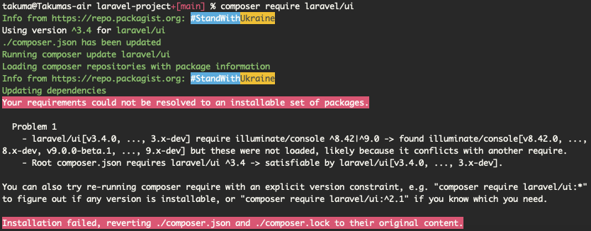

# Laravel6にjQueryをインストールする

環境
- Laravel 6系

```zsh
takuma@Takumas-air laravel-project+[main] % composer require laravel/ui
Info from https://repo.packagist.org: #StandWithUkraine
Using version ^3.4 for laravel/ui
./composer.json has been updated
Running composer update laravel/ui
Loading composer repositories with package information
Info from https://repo.packagist.org: #StandWithUkraine
Updating dependencies
Your requirements could not be resolved to an installable set of packages.

  Problem 1
    - laravel/ui[v3.4.0, ..., 3.x-dev] require illuminate/console ^8.42|^9.0 -> found illuminate/console[v8.42.0, ..., 8.x-dev, v9.0.0-beta.1, ..., 9.x-dev] but these were not loaded, likely because it conflicts with another require.
    - Root composer.json requires laravel/ui ^3.4 -> satisfiable by laravel/ui[v3.4.0, ..., 3.x-dev].

You can also try re-running composer require with an explicit version constraint, e.g. "composer require laravel/ui:*" to figure out if any version is installable, or "composer require laravel/ui:^2.1" if you know which you need.

Installation failed, reverting ./composer.json and ./composer.lock to their original content.
```



Laravel 6 系のプロジェクトには laravel/ui 1.x をインストールすれば良い

```zsh
$ composer require laravel/ui:1.2.0
```

## 参考

[[Laravel] laravel/ui がインストールできない](https://atuweb.net/202003f_laravel-ui-composer-error/)