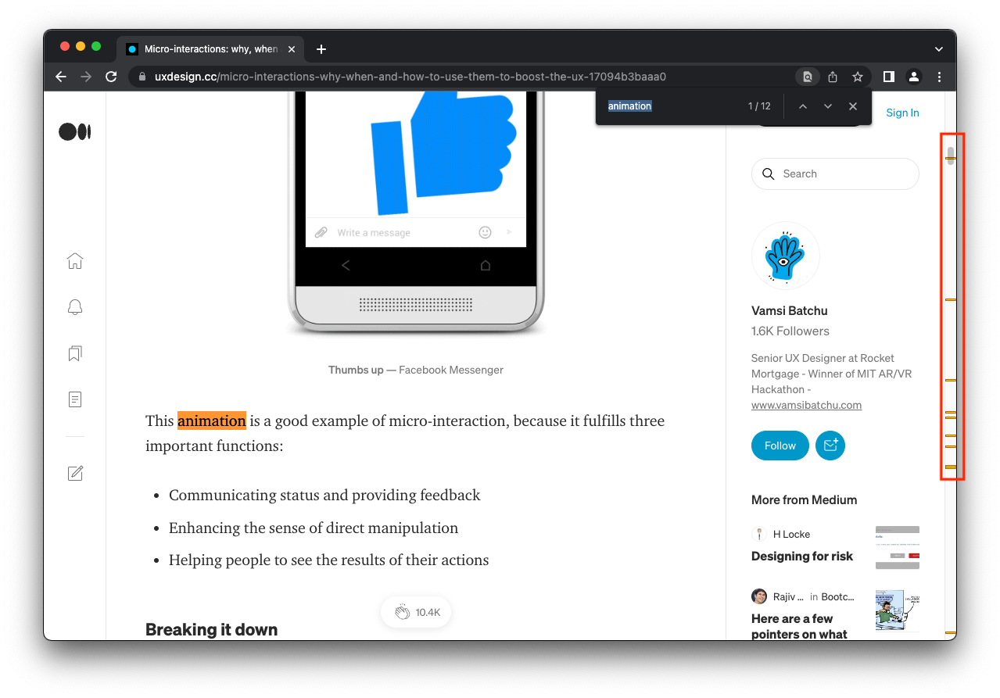
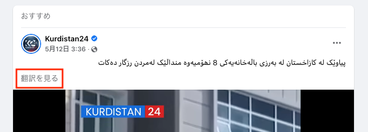

# 愛されるプロダクトを生むマイクロインタラクション

本ページは、[マイクロインタラクション ―UI/UXデザインの神が宿る細部](https://www.amazon.co.jp/%E3%83%9E%E3%82%A4%E3%82%AF%E3%83%AD%E3%82%A4%E3%83%B3%E3%82%BF%E3%83%A9%E3%82%AF%E3%82%B7%E3%83%A7%E3%83%B3-%E2%80%95UI-UX%E3%83%87%E3%82%B6%E3%82%A4%E3%83%B3%E3%81%AE%E7%A5%9E%E3%81%8C%E5%AE%BF%E3%82%8B%E7%B4%B0%E9%83%A8-Dan-Saffer/dp/4873116597) の要約です。

## 1.マイクロインタラクションとは

一言で言うと、
```
単一のシナリオに基づいてひとつの作業だけをこなす最小単位のインタラクションのこと
```

身近な例で言うと、



## 2. 注目されている背景

### 2.1 なぜ重要なのか

***まえがき*** から引用します。
```
マクロな尺度で仕事を進めると、デザインの大事な部分である「喜びを生む細部」が欠落しがちになることは否定できません。
私たちが「こよなく愛する製品」は、細部への配慮が行き届いた製品です。
美しい曲線、満足感を生むクリック、わかりやすいメンタルモデルといった細部への配慮が大きな意味を持つのです。
```
アプリやWebサイトが飽和するこの時代において、長く・深く愛されるプロダクトを提供するには ***いかに細部へ配慮が行き届いているか*** が重要であるとしています。

確かに、気の利いたインタラクションに出会うと感動すら覚え、一気に好きになる瞬間があります。

最近自分が体験したものだと、ソーシャルログイン（LINEやApple、Yahoo! JAPAN等のアカウント情報を利用して、会員登録やログインを簡略化できるログイン方法）で前回ログインした方法を教えてくれるマイクロインタラクションに感動しました。ソーシャルログインは、選択肢がありすぎて前回どれでログインしたのかを覚えてないケースが多く、使いにくさを感じていました。前回のログイン方法を教えてくれるマイクロインタラクションはまさに小さいけどけど「助かる！」なインタラクションでした。

そういった点を突き詰めて考えるのがマイクロインタラクションの仕事でしょう。

### 2.2 誤解されがちなこと

***マイクロインタラクション = 小さなアニメーションではありません。***

同書を読んだ方の中で非常に明確に指摘している文がありましたので引用します。[^1]

```
Web上の技術系の記事などを見ると、マイクロインタラクションについて、
アニメーションのことばかり説明しているものが多いように感じます。
実際、自分自身も、マイクロインタラクション = 小さなアニメーションという認識を持っていました。

しかし実際はそうではないと言い切れます。
アニメーションは、マイクロインタラクションにおけるフィードバックの一つ、
つまりあくまでマイクロインタラクションの一部です。
（これまで自分が認識していたものはマイクロインタラクションというよりも
マイクロアニメーションと呼んだ方がいいように感じています）
```

!!! question
    近年マイクロインタラクションはなぜ重要視されているのか。

!!! question
    マイクロアニメーションとマイクロインタラクションはどのように違うのか。またこの２つはどういった関係か。

## 3.最適な用途

- 単一タスクの処理
- 機器同士の接続
- 株価や気温など、単一のデータの取得
- テレビのチャンネル切り替えなど、現在進行中のプロセスの制御
- 特定の設定の変更
- ステータスメッセージなど、小さなコンテンツの表示や生成
- 特定の機能のオン・オフの切り替え

## 4. 4つの構造

| 4つの構造              | 
| -------------- | 
| トリガー       | 
| ルール         | 
| フィードバック | 
| ループとモード | 

### 4.1 トリガー

マイクロインタラクションを発動させるものがトリガーです。

トリガーには７つの原則があります。

| 7つの原則    |       | 
| ----- | --------- | 
| 原則1 | ターゲットとなるユーザーがコンテキスト（周囲の状況、文脈）からトリガーであると認識できるものをトリガーとする |
| 原則2 | トリガーにより常に同じことが始まるようにする |
| 原則3 | データを前面に出す |
| 原則4 | 視覚的なシグニファイアを「破壊」しないこと |
| 原則5 | マイクロインタラクションの使用頻度が高ければ高いほど、見つけやすいものでなければならない |
| 原則6 | 偽のシグニファイアが生成されないようにする |
| 原則7 | トリガー自体では表せない情報を提供する時に限ってラベルを付加する |

また、トリガーは手動トリガーとシステムトリガーの2種類に分かれます。

#### 4.1.1 手動トリガー

画面に表示されるボタンやスライダーなど実際に手動でマイクロインタラクションを開始させる能力を持つもの。

形態としては以下のようなものがあります。

- コントロール
- アイコン
- 入力フォーム
- 声
- タッチ
- ジェスチャー

##### トリガーを構成する３要素

1. コントロールそのもの

         - 動いている物体    
           例）拍動するようなアニメーションのアイコン

         - シグニファイアとラベルを持った物体
           例）ラベル付きの標準的なボタン

         - ラベルの付いた物体
           例）ラベル付きのアイコン

         - 物体のみ
           例）アイコン

         - ラベルのみ
           例）メニュー項目

         - 不可視トリガー（視覚情報なし）

2. コントロールの状態

         - デフォルト
         - ホバー
         - ロールオーバ−
         - 起動中
         - アクティブ
         - トグル

3. 文字あるいはラベル

      以下のことを守る必要があります。

         - トリガー全体では表せない情報を提供する時に限ってラベルを付与する
         - 短い言葉でしっかりした説明になっていて明快な言葉遣い
         - 首尾一貫
         - 呼び名の統一


#### 4.1.2 システムトリガー

トリガーになるものとしては以下のようなものがあります。

- エラー
- 位置情報
- データの到着
- 内部データ（時刻やシステムリソースの状態など）
- その他のマイクロインタラクション
- 他人（チャットに答える、写真やメッセージを投稿する、友達リクエストを送る など）

##### 設定すべきルール

1. 起動する頻度
2. 何が既知であるか
  >例えば現在夜中だとわかっていれば、システムトリガーの頻度を下げることができる。

3. トリガーが起動されたことを示す表示はあるか
4. エラーが起きるとどうなるか
  > たとえばネットワークの切断やデータの不足が起きた時に、中止するか・再試行するか。再試行するなら再試行するまでの間隔はどの程度にするか。

!!! question
    「トリガーにより常に同じことが始まるようにする」ことの実例はどのようなものがあるか。

!!! question
    「データを前面に出す」のはなぜか。

!!! question
    不可視トリガーはどのような場合に導入するのが適切か。

!!! question
    「偽のシグニファイアが生成されないようにする」のは何のためか。

!!! question
    「トリガー自体では表せない情報を提供する時に限ってラベルを付加する」のは具体的にどんなケースがあるか。

### 4.2 ルール

製品やサービスは改良されていきます。その中で仕様・ルールが複雑になっていくため、ユーザーの混乱を生んだりモンタルモデルを崩してしまう可能性があります。ルールを先に規定しておくことで、そういったものを未然に防ぎます。

また、いかに賢い機能を提供できるかは、ルールで検討し得る範囲です。

#### ルールで決定する必要のあるもの

- 起動された時にどう応えるか
- ユーザーが進行中のマイクロインタラクションをどう制御できるか
- 操作の順番とそのタイミング
- どこから取得するとどのようなデータが使われるのか
- 使われるアルゴリズムとパラメーター
- いつどのようなフィードバックが返されるか
- マイクロインタラクションがどのモードにあるか
- 繰り返されるのか、頻度はどのくらいか
- 終わると何が起こるか

**ポイント① ゼロから始めない**

利用できるデータ

- 使われているプラットフォームやデバイス
- 時刻
- 室内の物音
- そのマイクロインタラクションが最後に使われてから経過した時間
- ユーザーは会議中か
- ユーザーはひとりか
- バッテリーの寿命
- 現在地や機器の移動方向
- ユーザーの過去の行動

**ポイント② 複雑さを軽減する**

複雑な作業は、基本はマイクロインタラクション側で意思決定をしていく方を推奨する
中心となる複雑さはどこにあるかを見つける
全体の処理過程を考慮してユーザーが特にどの部分に関与したいと思うか、いつ関与したいと思うかを検討する
ユーザーによる制御がどうしても必要な場合は制御できるようにする

#### 選択肢の制限と賢いデフォルト

マイクロインタラクションにおいては、一般にはルールが少ないほどわかりやすく優れたものになります。選択肢は絞り、その代わりに賢いデフォルトを提示するのがよいです。

大きく「操作が単純なもの」と「結果の認識が容易なもの」に分けられます。

上記の２つを実現する方法として、「ポカよけ」「マイクロコピー」「アルゴリズム」が使えます。

**ポカよけ**

ライトニングケーブルは表裏どちらでも使える
Gmailの添付という文字が入ってるけど添付されていない警告

**マイクロコピー**

原則：ラベルで十分なら、操作を指示する言葉は決して使わない。ただし、必要最低限のものがあるかは確認すべし。
良い例：ショップの「お問い合わせ」欄に、営業時間以外は電話番号の横に「申し訳有りませんが、閉店中です」といったメッセージを表示する。
言葉が入らないなら、アイコンで代用しよう。
誤解を招くラベルは避ける。
「前へ」「次へ」
入力欄の中にラベルを入れるのはNG。OKなのは、具体例など見えなくなってもいいもの。
名称の揺れは揃える。
日時に関しては相対的な表現にした方が直感的にわかりやすい。
否定表現は避ける。
例）ニュースレターの受信を停止したくない方は、この欄のチェックを外さないでください。

**アルゴリズム**

処理順序
分岐
繰り返し
変数

!!! question
    マイクロインタラクションにおいて、なぜルールが重要なのか。

!!! question
    優れたルールとはどのようなものか。

### 4.3 フィードバック

| フィードバックの4つの原則 |  |
| - | - |
| 原則1 | フィードバックでユーザーに負担をかけない |
| 原則2 | フィードバックは的はずれなものであってはならない |
| 原則3 | 最小のフィードバックで最大の最大限のメッセージを伝える |
| 原則4 | 見落とされがちなものを使ってメッセージを伝える |

マイクロインタラクションが起動されたら、「何が行われたか」と「その結果として何が起きたか」の２点を知らせる必要があります。

#### 伝達する内容

- 何かが起きた
- ユーザーが何かを実行した
- 処理が始まった
- 処理が終了した
- 処理が続行中
- ユーザーに「それはできない」と知らせる

ただし、なんでもかんでもフィードバックするのではなく、何が最適なフィードバックかを考えるべきです。重要なのは「必要性」と「タイミング（頻度）」です。

ユーザーが知るべきかどうかの「必要性」と「タイミング（頻度）」が決まれば、形式やデザイン（視覚・聴覚・触覚、あるいはその組み合わせ）はデザイナーの好みで構いません。

#### フィードバックの必要性を判断するポイント

1. 手動トリガーの直後、あるいはルールを手動で調整している最中やそのあと

      >例：スポイトツールで選択中に時に表示される色

2. システムトリガーによって、マイクロインタラクション（もしくは関連する機能）の状態に著しい変化がもたらされた場合
   
    >例：バックグラウンドで行われるメールの受信チェックは、そのプロセスを知らせる必要はないが、新着があった場合は知らせる必要がある。

3. ユーザーがもう少しでルールを破りそうな場合（あるいは破ってしまった場合）は例外なく常に

    > エラーが起こる時など

4. システムがコマンドを実行できない時

      >例：不具合が発生している

5. 重要な処理なら必ずその進捗状況を表示する（時間がかかる場合は特に）

      >アップロード・ダウンロードの例：Transmit4、各種ブラウザ


#### フィードバックの方法

**視覚**
Nike Run Clubではランニングのペースを色分けして地図上に表示する
アニメーション
メッセージ

**聴覚**
イヤコン
音声

**触覚**
ハブティクス

!!! note
    ユーザーによる動作に対してはできる限り視覚的フィードバックを出すようにする。強調や注意喚起が必要なら、サウンドやハプティクスによるフィードバックを加える。


#### ルール

**コンテキストによる変化**
例）夜になると音量を下げる

**継続時間**
フィードバックを続ける時間の長さは？フィードバックを停止するものは何か？

**程度**
表示の明るさや動きの速度、音量や振動の強さをどの程度にするか？周囲に溶け込ませるか？それとも目立たせるか？時間の経過とともに強度を増やすか減らすか、変えないか？

**繰り返し**
フィードバックを繰り返すか？その頻度は？ずっと繰り返すか？それとも、2,3秒で停止させるか？

#### 個性を表現する手段としてのフィードバック

エラーや長時間を要するダウンロードのように、ユーザーがイライラする瞬間こそが、緊張を和らげる「個性」を発揮するのにもってこいのタイミングである。

具体な良い例としては、Not Foundページに

!!! question
    原則4の「最小のフィードバックで最大の最大限のメッセージを伝える」具体例はどのようなものがあるか。

!!! question
    最適なフィードバックを考える上で重要な視点は何か。

!!! question
    「ユーザーによる動作に対してはできる限り視覚的フィードバックを出すようにする」のはなぜか。

!!! question
    フィードバックにおいて「個性」を発揮するのに適したタイミングはどのような場合か。

### 4.4 ループとモード

!!! question
    マイクロインタラクションにおけるモードとは何か？具体例は？注意すべき点は何か？

!!! question
    ロング・ワオとは何か？目的と具体例を説明せよ。

!!! question
    マイクロインタラクションにおける4つの構造とは何か。

## 5.活かし方

マイクロインタラクションを活かすアプローチには３つの手法があります。

### 5.1 個々を磨く

マイクロインタラクションをひとつひとつ個別に検討していくことで、比類のない記憶に残る瞬間（Signature Moment）を生み出せる可能性がある。

例えば、初代iPodのスクロールホイールのような洗練されたトリガーやFacebookの「いいね！」ボタンなどが挙げられる。

「記憶に残る瞬間」は、企業のブランドを確立したり、高い評価を得たりする上で非常に効果的である。

### 5.2 ひとつのマイクロインタラクション＝製品

「たったひとつの仕事を巧みにこなす製品」を作るアプローチ。「実用最小限の製品」がひとつのマイクロインタラクションから成り立っているケース。

例としてはInstagramやEvernoteが挙げられる。

### 5.3 多数をまとめ上げる

多数の（ことによっては何百もの）マイクロインタラクションをひとつの複雑なデジタル製品にまとめあげるアプローチ。

!!! question
    マイクロインタラクションをベースにして、アプリやサービスを構築する3つの手法を説明せよ。

## 6.サエないマイクロインタラクションを改善するチェックリスト

- [ ] 「記憶に残る瞬間」にする必要はあるか？
- [ ] ゼロから始めようとしているのか？
- [ ] 一番重要なものはなにか？それは前面に出せるか？
- [ ] カスタムコントロールが適しているか？
- [ ] ヒューマンエラーを予防できるか？
- [ ] 見落とされがちなものを活用しているか？
- [ ] 上級ユーザー向けに不可視トリガーを作れないか？
- [ ] テキストやアイコンは自然か？
- [ ] アニメーションを加えればもっと表情や動きが出せるだろうか？
- [ ] 他に加えるべきフィードバックの手段はないか？
- [ ] ユーザーが二回目に接した時何が起こるか？100回目には？

## 7.マイクロインタラクションのテスト

テストには定性的データと定量的データを集めることが重要ですが、中でも以下の4項目が特に重要です。

1. ひとつのステップではなく、マイクロインタラクション全体の目的を正しく理解していること
2. どのデータが重要であるかを理解すること
3. マイクロコピーが必要かどうか、そして必要な場合は明快で理解できるものかどうか
4. 時間とフロー

### 7.1 定性的なテスト

- [ ] クリック、タップなど、コントロールの操作が多すぎないか
- [ ] 混乱していないか
- [ ] 何が起こったのかよくわからない？
- [ ] 何かが起きたような気もするが···
- [ ] 探しているものが見つからない
- [ ] どこにいるのかわからない
- [ ] 自分のデータ、コンテンツ、入力に何が起こったのかわからない
- [ ] これをクリック、プッシュ、タップすると何が起きるのか
- [ ] そのボタンに気づかなかった
- [ ] そんなことができるとはわからなかった
- [ ] 自分は何をしているのか
- [ ] 今、見えているのは何か

### 7.2 定量的なテスト

- [ ] 実行率
- [ ] マイクロインタラクション全体の所要時間
- [ ] 特定のステップの所要時間
- [ ] ステップ数
- [ ] クリック、タップあるいは選択した回数
- [ ] システムエラー数
- [ ] ヒューマンエラー数

## 8.所感

マイクロインタラクションの根本は洞察力にある。

「使いにくい」「不便だな」のセンサーを磨く


[^1]: [「マイクロインタラクション UI/UXデザインの神が宿る細部」を読んだ｜KDE BLOG](https://kde.hateblo.jp/entry/2020/09/21/170009)

[Little Big Details](https://littlebigdetails.com/)